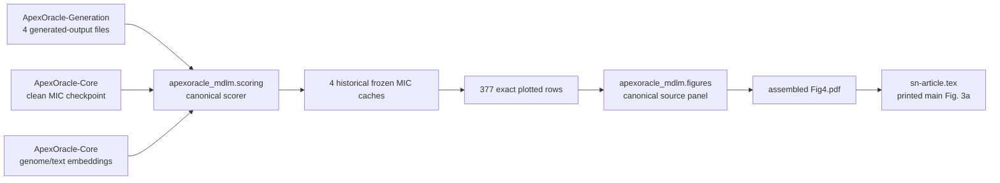

# Legacy 代码 ledger、依赖血缘与清理门槛

> 建立日期：2026-08-09
> 当前状态：tracked code/config 全量 ledger 与第一条正式论文图血缘已建立；尚未删除任何 legacy 文件

## 1. 这份记录解决什么问题

本仓库不是单纯的上游 MDLM checkout，也不是一个结构清晰的 ApexOracle module。它同时包含上游
runtime、被本地修改的 upstream 文件、作者新增但彼此大量复制的 downstream drivers，以及重构后新增的
canonical package。后续清理不能按文件名中的 `temp`、`debug`、`fix` 或 `clean` 猜测文件是否重要。

本轮因此先冻结四类证据：

1. 每个 tracked code/config 资产的来源、功能家族、静态依赖、论文角色、目标处置和逐文件删除门槛；
2. 同仓库 `import` 边，以及没有 import、但实际复制了相同 function/class 的 AST-normalized clone 血缘；
3. 指向 ApexOracle-Core、ApexOracle-Generation、ApexOracle-Evo2 和 PepLink 的静态跨仓库引用；
4. 正式论文图的 producer → checkpoint/embedding/generated outputs → cache → plotted rows → panel PDF →
   manuscript consumer 血缘。

建立 ledger 不代表允许删除。任何一行只有在自身 `deletion_gate` 全部满足并把状态更新为明确的
`delete_ready` 后，才进入删除批次。

作者已确认最终目标不是“保守地把所有可疑文件继续放在 public branch”，而是“保守地保存行为，积极地
清理旧实现”：重要或暂时不确定的文件先迁移独有行为和补 parity evidence，然后删除原文件；没有独有
行为的文件完成 consumer/provenance 核验后由 snapshot tag 保存并删除。最终 active tree 不建立新的
`legacy/` 源码堆。

## 2. Canonical 记录

| 文件 | 内容 | 维护方式 |
| --- | --- | --- |
| `reproducibility/code_asset_ledger.csv` | 每个 tracked `.py/.ipynb/.sh/.yaml/.yml/.json` 资产一行 | 由 audit script 全量重建 |
| `reproducibility/code_dependency_edges.csv` | local import 与 normalized external-repo reference edges | 自动生成 |
| `reproducibility/definition_clone_groups.csv` | 跨文件相同 class/function AST 的 clone groups | 自动生成 |
| `reproducibility/code_lineage_summary.json` | 完整性计数与 family/origin 汇总 | 自动生成 |
| `reproducibility/paper_figure_lineage.json` | 正式 Fig. 3a 的人工核验资产/consumer 血缘 | 人工审计、脚本验证 |
| `reproducibility/paper_fig3a_plotted_data.csv` | Fig. 3a 四组 violin 的 377 个 exact plotted rows | 从冻结 cache 导出并验证 |

构建与 stale check：

```bash
python scripts/audit/build_code_lineage_ledger.py
python scripts/audit/build_code_lineage_ledger.py --check
```

Fig. 3a 的本机完整小资产核验与 CSV stale check：

```bash
/home/tianang/anaconda3/bin/conda run --no-capture-output -n mdlm \
  python scripts/audit/verify_paper_figure_lineage.py
```

默认不会重新 SHA-256 约 9.17 GB 的正式 checkpoint；其 size、schema 和已冻结 SHA 仍会被引用。需要重做
大文件 hash 时显式加 `--include-large-assets`。首次或有意更新 plotted rows 时才使用
`--write-plotted-data`，日常验证不得覆盖 CSV。

本 ledger 建立时已实际运行一次 `--include-large-assets`；正式 checkpoint 与 manifest 中
`c0d7c2be...6802` 的 SHA-256 一致。日常 CI 不需要重复读取该大文件。

## 3. 来源边界

以下是已由 Git tree/blob 验证的事实：

- upstream source 基线取本仓库两个 remote 历史的共同代码祖先 `b06b09c`；`origin/master` 后续差异主要为
  upstream README/license 维护，不能把作者代码误归入 upstream；
- `legacy-code-snapshot-2026-08-09` 固定重构开始前作者源码；
- 当前资产分为 `upstream_unmodified`、`upstream_locally_modified`、`apexoracle_legacy_added` 和
  `post_snapshot_canonical`；
- 本轮明确把 upstream 与 mixed-origin 文件排除在“清掉自己乱代码”的直接删除对象之外。mixed-origin
  文件必须先把 upstream 行为和 ApexOracle 本地变化拆开。

准确计数以 `code_lineage_summary.json` 为准。它会随新的 canonical audit/test 文件增加，避免本文复制一个
很快过期的总数。`code_asset_ledger.csv` 的 `origin_class`、`family` 和 `sha256` 可定位到单个文件。

## 4. 为什么同时记录 import 和复制血缘

这些 legacy drivers 经常整段复制 `RegressionHead`、`FirstTokenAttention_genome`、embedding loader、dataset
和 metric helper，而没有互相 import。只画 import graph 会漏掉真正的维护关系。因此：

- `code_dependency_edges.csv` 回答“运行时显式引用谁”；
- `definition_clone_groups.csv` 回答“哪些文件携带了相同实现副本”；
- clone group 只能证明 AST 完全相同，不能证明同名但不同 AST 的变体等价；
- 删除一个副本前仍要核对调用 contract、checkpoint schema、config 和 output consumer，不能只看 digest。

这也解释了为什么最合理的清理顺序是先把 shared loader/head/scorer 迁入 canonical package，再按 consumer
逐个撤下 root drivers，而不是直接批量删除相似文件。

## 5. 删除保护等级

| 等级 | 触发条件 | 当前规则 |
| --- | --- | --- |
| P0 正式产物 | 论文主图/补图、reviewer figure/table、正式 checkpoint producer/consumer | 在 canonical reproduction capsule 和 manuscript provenance 完成前绝不删除 |
| P1 跨仓库接口 | Generation/Core/Evo2 外部 caller、filename/checkpoint/embedding contract | 先冻结接口并完成两侧 parity；不得单仓猜测 |
| P2 科学协议 | trainer/scorer/evaluator、dataset split、clean/noisy/padding profile | 先建立 characterization 和正式资产 replay |
| P3 待归档辅助代码 | debug/temp/notebook/一次性 plot，且没有 P0--P2 角色 | 人工核验后可成为 snapshot-only candidate |
| Protected | upstream、mixed-origin、post-snapshot canonical | 不属于 legacy 批量清理；按 upstream attribution 或正常 deprecation 管理 |

一个文件只要存在更高等级的未决条件，就按最高等级保护。`snapshot-only candidate` 也不等于
`delete_ready`。但保护等级只决定“删除前先保住什么”，不决定“原始混乱文件永久保留”。P0--P3 的最终
落点都必须是 canonical clean implementation 或 snapshot-only recovery，而不是继续暴露旧副本。

## 6. Fig. 3a 已冻结并迁移的血缘

这里的 Fig. 3a 指论文排版后的第三个 main figure 的 panel a。历史文件名仍为 `Fig4.pdf`，LaTeX label
仍为 `fig:4`，不能据文件名误判为论文 Fig. 4。



已由代码、文件 hash、cache metadata 和数值重算验证：

- 历史 producer 是 tagged `judge_generated_mols_MIC.py`；canonical producer 是
  `scripts/reproduce/plot_paper_fig3a.py` 与 `apexoracle_mdlm.figures.generated_mic`；
- BAA-3170 使用 length 368，BAA-3197 使用 length 232；`target_MIC=1` 标为 Guided，历史
  `target_MIC=1000` operational label 标为 Unconditional；
- 四组 sample size 为 24、188、59、106；plotted medians 为 223、43、98、61 µmol；
- log2 MIC 的 two-sided Mann–Whitney p 值为 `0.0004409695...` 和 `0.0209674453...`，图中显示
  `0.0004` 与 `0.0210`；
- source panel PDF、assembled PDF、四个 Generation inputs、四个 cache 和正式 checkpoint 的 SHA-256
  均已写入 `paper_figure_lineage.json`。
- 正式 checkpoint 和两条真实 Generation SELFIES 上，canonical scorer 与 tagged legacy 的逐条和
  batch=2 logits/MIC 均 `torch.equal`，最大差异 `0.0`；canonical figure 的 150 dpi raster 与历史 panel
  shape 和所有 RGB channels 完全一致。

根据现有证据作出的高置信推断：source panel 的视觉布局、标签和两个 p 值与 assembled panel a 一致，
因此它就是组图来源。

仍待确认：没有找到最终四 panel 组图所用软件/命令；也没有找到精确 timestamp 到 2026-04-03 运行时刻的
producer commit/log。因此 ledger 明确记录了证据强度，没有伪造不存在的 revision provenance。

结论：这个 P0 gate 已满足。原 642 行混合实现已删除，行为拆为 canonical scoring library、parameterized
CLI、figure capsule 和机器可读 parity record。当前同名 root 文件不是旧实现，只是为 Core 已验证动态
import 保留的 thin compatibility bridge；ledger disposition 为 `remove_bridge_after_core_caller_migration`。
Core 改用 package 并通过跨仓库 caller test 后，bridge 也从最终 public tree 删除。旧实现始终可由 snapshot
tag 精确恢复。

## 7. Peptide-table scorer 已完成迁移删除

历史 `temp_predict_mic_from_peptide_csv.py` 没有外部 runtime caller 或正式论文/reviewer consumer，但其
peptide → RDKit SMILES → SELFIES、多 strain batch scoring 和 invalid-row preservation 是可复用功能，因此
没有直接作为 snapshot-only 丢弃。该行为现已迁入 `apexoracle_mdlm.scoring.peptide_table` 和参数化 CLI，
并以正式 checkpoint、历史 camel-milk input/output 做过 exact parity。

审计还发现 batch size 是科学协议：旧 DLM 忽略 attention mask，同一 sequence 所见 padding 随 batch
composition 改变。历史 73,520-row 输出使用 batch size 32；canonical manifest 必须记录该值。旧 748 行
root script 的 migration gate 已满足并从 active tree 删除，hash、counts、parity 和恢复命令见
`reproducibility/peptide_table_migration_parity.json`。

## 8. Small-molecule screen 已冻结并迁移的血缘

正式 44,608-entry screen 的 active producer 已迁入
`scripts/reproduce/score_small_molecule_screen.py` 与
`apexoracle_mdlm.scoring.small_molecule_screen`。旧 `temp_judge_generated_mols_MIC.py` 的独有 collection
行为——逐 raw row batch=1、去 padding、duplicate SELFIES last-write-wins、SELFIES decode、wide CSV 与逐
strain violin——均已有 canonical replacement。

已由 frozen assets 和真实 checkpoint 验证：两个 target inputs 各 49,331 rows/44,608 unique SELFIES，
两份历史 CSV 各 44,608 rows；decoded SMILES set 精确相等，全部 MIC finite positive；tagged legacy 与
canonical 在两条真实 BAA-3170 molecule 上 logits/MIC 逐值相等。canonical 输出只修复旧 `set` iteration
造成的不确定行序。机器可读记录为 `small_molecule_screen_lineage.json` 和
`small_molecule_screen_scorer_parity.json`。

根据现有证据只能确认 shell-history execution order、closed input/output artifacts 和 snapshot scorer
parity；没有 timestamped original producer revision。因此不声称 snapshot source 与最初 44,608-entry run
逐字节相同。该边界已清楚记录后，旧 root file 满足 deletion gate，由 tag 恢复。

## 9. 通用 peptide candidate screen 与历史 case

`temp_judge_mol_mic_with_fig.py` 的有效行为已迁为 package primitives 和
`scripts/reproduce/screen_peptide_candidates.py`。public API 不使用 milk/camel/project 名；历史数据来源、
13 个相同输入、5 个 strain outputs、1,081 images、阈值、hash 与 evidence boundary 单独记录在
`docs/HISTORICAL_PEPTIDE_SCREEN_CASE.md` 和 reproducibility manifests。

tagged/canonical scorer 在正式 checkpoint/真实 inputs 上 exact parity；tagged/canonical parser 在全部
1,081 retained rows 上一致；qualified outputs 可逐行从 source row 重建，选定 PNG exact raster parity。
因此 temp driver deletion gate 已满足并从 active tree 删除。`smiles_to_peptide.py` 仍是两个未迁移 legacy
drivers 的 thin compatibility bridge，最终在这些 callers 迁入 package 后删除。

## 10. Generation candidate screen 与 round-trip caller 已完成清理

`judge_mol_mic_with_fig.py` 独有的多文件循环现由
`screen_peptide_candidates.py --job-manifest` 表达；共享 MIC scorer、peptide qualification 和 rendering 已在
上一批完成正式 checkpoint/parser/raster parity。本批另冻结外部 candidate layout 为 81 files/73 rows，
并记录当前 legacy source 的 BS profile 与论文 BAA pool 不同，所以不会伪称恢复了不存在的 producer log。

`judge_smi2pep2smi_mol_mic_with_fig.py` 的 sequence round-trip 是无 threshold 的内部 normalization diagnostic；
没有外部 caller 或正式 consumer，两份输出和 15 张图已 hash。其唯一额外依赖 `aa_seq_to_smiles.py` 在 MDLM
中没有第二个 caller，Core 的不同副本也不依赖 MDLM 文件。因此两个 drivers、MDLM root builder 和 parser
bridge 均满足 gate 并从 active tree 删除；恢复命令和机器可读证据见
`docs/GENERATION_PEPTIDE_SCREEN_LINEAGE.md`。

## 11. Synergy candidate judges 已完成迁移清理

两个 root synergy judges 的有效核心是 all-data experimental symmetric-pair probability scorer，已迁为
canonical library/CLI/checkpoint schema；Generation 正式 checkpoint 与真实 SELFIES 的 exact GPU parity 已
通过。Active judges 本身存在 checkpoint schema、attention return、label/threshold 四类已复现错误，不能作为
reference；历史 PDF 无正式 consumer。因此两个 mixed drivers 由 snapshot/lineage 恢复后从 active tree 删除，
而 checkpoint producer trainers 留待后续独立合并 clean/noise profiles。

## 12. Interpretability notebooks/scripts 已完成迁移清理

论文 ApexOracle-18 attention case 已迁为 canonical forward、参数化 CLI、Core-compatible saved-window mapping
和两套 exact tables。两个 scripts byte-identical，`show.ipynb` 前六个 code cells 又重复于完整 interpretability
notebook；四项均由 snapshot hashes 恢复后从 active tree 删除。Attention 已明确为四 heads 平均且只能作
hypothesis-generating association；完整证据边界见 `docs/INTERPRETABILITY_LINEAGE.md`。

## 13. Legacy small-molecule debug 与 Fig. 5b CFU producer 已完成迁移

四个 `debug_temp_SMs_MIC_analysis*.py` 已逐项核验。正式可复用行为只包括 `<=15` cutoff、canonical
structure set 与 overlap summary，现由 `apexoracle_mdlm.scoring.small_molecule_screen` 和
`analyze_small_molecule_screen.py` 承担；历史 filtered tables content/order exact match。`_3/_4` 完全重复，
`5×IQR` 没有 saved output 或正式 consumer，同一 benchmark reference overlap 也不是独立 validation。四个 root
scripts 已满足 gate 并由 snapshot 恢复。

`p_value_reference.py` 有正式 Fig. 5b consumer，不能作为普通 debug 丢弃。其绘图行为已迁为 validated library/
CLI；原脚本只显示四个 hard-coded p-value strings，不计算 statistics。本机没有找到两份 raw CSV，manuscript
也未写 test definition，因此机器可读记录明确标记 statistical reproducibility incomplete。clean replacement
与 snapshot recovery 允许删除 root script，但不能据此声称正式 p 值已重算。完整证据见
`docs/LEGACY_ANALYSIS_MIGRATION.md`。

## 14. Root debug 与一次性 embedding scripts 已完成清理

`debug.py/debug_2.py/debug_3.py` 分别只是 dataframe peek、无 assertion/reference 的 hard-coded GPU smoke 和
单 MolPort shard canonical-string diagnostic。两个 milk scripts byte-identical；它们与 `temp_stf_polymer.py`
均复制同一 DLM wrapper，仅用于一次性 ignored embedding export。资产 key/shape/hash、source counts 和消费者
搜索已冻结；没有任何 runtime/论文/reviewer/output consumer。正式 candidate scoring、MolPort matching 和
现有 encoder 已覆盖当前所需行为，故不新建 API，六个 sources 全部由 snapshot 接管后删除。详见
`docs/DEBUG_FILE_CLEANUP.md`。

## 15. 下一轮人工核验队列

自动 ledger 已把所有包含 plotting code 或 notebook outputs 的文件标为未完成 paper-consumer audit；除
Fig. 3a 外，尚未确认它们是否对应正式论文或 reviewer 图。优先级如下：

1. 下一批转向仍在 active tree 的 chemistry/catalog utilities 与 embedding producer family；继续先核对正式
   consumer 和独有协议，再决定迁移或 snapshot-only。

人工核验完成后，对重要/不确定的独有行为直接建立 clean replacement，对确认无独有角色的文件转为
snapshot-only；两类都在 gate 满足后删除原始 root 文件。仍按小批次迁移与删除，不做一次性 filesystem
大扫除。
