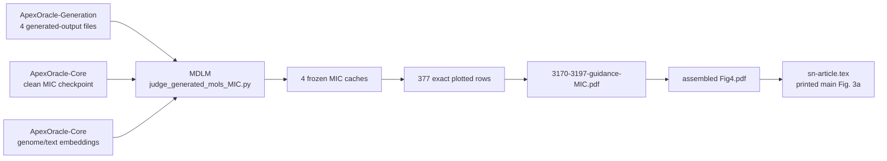

# Legacy 代码 ledger、依赖血缘与清理门槛

> 建立日期：2026-08-09
> 当前状态：tracked code/config 全量 ledger 与第一条正式论文图血缘已建立；尚未删除任何 legacy 文件

## 1. 这份记录解决什么问题

本仓库不是单纯的上游 MDLM checkout，也不是一个结构清晰的 ApexOracle module。它同时包含上游
runtime、被本地修改的 upstream 文件、作者新增但彼此大量复制的 downstream drivers，以及重构后新增的
canonical package。后续清理不能按文件名中的 `temp`、`debug`、`fix` 或 `clean` 猜测文件是否重要。

本轮因此先冻结四类证据：

1. 每个 tracked code/config 资产的来源、功能家族、静态依赖、论文角色、目标处置和逐文件删除门槛；
2. 同仓库 `import` 边，以及没有 import、但实际复制了相同 function/class 的 AST-normalized clone 血缘；
3. 指向 ApexOracle-Core、ApexOracle-Generation、ApexOracle-Evo2 和 PepLink 的静态跨仓库引用；
4. 正式论文图的 producer → checkpoint/embedding/generated outputs → cache → plotted rows → panel PDF →
   manuscript consumer 血缘。

建立 ledger 不代表允许删除。任何一行只有在自身 `deletion_gate` 全部满足并把状态更新为明确的
`delete_ready` 后，才进入删除批次。

## 2. Canonical 记录

| 文件 | 内容 | 维护方式 |
| --- | --- | --- |
| `reproducibility/code_asset_ledger.csv` | 每个 tracked `.py/.ipynb/.sh/.yaml/.yml/.json` 资产一行 | 由 audit script 全量重建 |
| `reproducibility/code_dependency_edges.csv` | local import 与 normalized external-repo reference edges | 自动生成 |
| `reproducibility/definition_clone_groups.csv` | 跨文件相同 class/function AST 的 clone groups | 自动生成 |
| `reproducibility/code_lineage_summary.json` | 完整性计数与 family/origin 汇总 | 自动生成 |
| `reproducibility/paper_figure_lineage.json` | 正式 Fig. 3a 的人工核验资产/consumer 血缘 | 人工审计、脚本验证 |
| `reproducibility/paper_fig3a_plotted_data.csv` | Fig. 3a 四组 violin 的 377 个 exact plotted rows | 从冻结 cache 导出并验证 |

构建与 stale check：

```bash
python scripts/audit/build_code_lineage_ledger.py
python scripts/audit/build_code_lineage_ledger.py --check
```

Fig. 3a 的本机完整小资产核验与 CSV stale check：

```bash
/home/tianang/anaconda3/bin/conda run --no-capture-output -n mdlm \
  python scripts/audit/verify_paper_figure_lineage.py
```

默认不会重新 SHA-256 约 9.17 GB 的正式 checkpoint；其 size、schema 和已冻结 SHA 仍会被引用。需要重做
大文件 hash 时显式加 `--include-large-assets`。首次或有意更新 plotted rows 时才使用
`--write-plotted-data`，日常验证不得覆盖 CSV。

本 ledger 建立时已实际运行一次 `--include-large-assets`；正式 checkpoint 与 manifest 中
`c0d7c2be...6802` 的 SHA-256 一致。日常 CI 不需要重复读取该大文件。

## 3. 来源边界

以下是已由 Git tree/blob 验证的事实：

- upstream source 基线取本仓库两个 remote 历史的共同代码祖先 `b06b09c`；`origin/master` 后续差异主要为
  upstream README/license 维护，不能把作者代码误归入 upstream；
- `legacy-code-snapshot-2026-08-09` 固定重构开始前作者源码；
- 当前资产分为 `upstream_unmodified`、`upstream_locally_modified`、`apexoracle_legacy_added` 和
  `post_snapshot_canonical`；
- 本轮明确把 upstream 与 mixed-origin 文件排除在“清掉自己乱代码”的直接删除对象之外。mixed-origin
  文件必须先把 upstream 行为和 ApexOracle 本地变化拆开。

准确计数以 `code_lineage_summary.json` 为准。它会随新的 canonical audit/test 文件增加，避免本文复制一个
很快过期的总数。`code_asset_ledger.csv` 的 `origin_class`、`family` 和 `sha256` 可定位到单个文件。

## 4. 为什么同时记录 import 和复制血缘

这些 legacy drivers 经常整段复制 `RegressionHead`、`FirstTokenAttention_genome`、embedding loader、dataset
和 metric helper，而没有互相 import。只画 import graph 会漏掉真正的维护关系。因此：

- `code_dependency_edges.csv` 回答“运行时显式引用谁”；
- `definition_clone_groups.csv` 回答“哪些文件携带了相同实现副本”；
- clone group 只能证明 AST 完全相同，不能证明同名但不同 AST 的变体等价；
- 删除一个副本前仍要核对调用 contract、checkpoint schema、config 和 output consumer，不能只看 digest。

这也解释了为什么最合理的清理顺序是先把 shared loader/head/scorer 迁入 canonical package，再按 consumer
逐个撤下 root drivers，而不是直接批量删除相似文件。

## 5. 删除保护等级

| 等级 | 触发条件 | 当前规则 |
| --- | --- | --- |
| P0 正式产物 | 论文主图/补图、reviewer figure/table、正式 checkpoint producer/consumer | 在 canonical reproduction capsule 和 manuscript provenance 完成前绝不删除 |
| P1 跨仓库接口 | Generation/Core/Evo2 外部 caller、filename/checkpoint/embedding contract | 先冻结接口并完成两侧 parity；不得单仓猜测 |
| P2 科学协议 | trainer/scorer/evaluator、dataset split、clean/noisy/padding profile | 先建立 characterization 和正式资产 replay |
| P3 待归档辅助代码 | debug/temp/notebook/一次性 plot，且没有 P0--P2 角色 | 人工核验后可成为 snapshot-only candidate |
| Protected | upstream、mixed-origin、post-snapshot canonical | 不属于 legacy 批量清理；按 upstream attribution 或正常 deprecation 管理 |

一个文件只要存在更高等级的未决条件，就按最高等级保护。`snapshot-only candidate` 也不等于
`delete_ready`。

## 6. Fig. 3a 已冻结的血缘

这里的 Fig. 3a 指论文排版后的第三个 main figure 的 panel a。历史文件名仍为 `Fig4.pdf`，LaTeX label
仍为 `fig:4`，不能据文件名误判为论文 Fig. 4。



已由代码、文件 hash、cache metadata 和数值重算验证：

- producer 是 `judge_generated_mols_MIC.py`，正式角色是
  `main_figure_3a_mic_distribution_source_panel`；
- BAA-3170 使用 length 368，BAA-3197 使用 length 232；`target_MIC=1` 标为 Guided，历史
  `target_MIC=1000` operational label 标为 Unconditional；
- 四组 sample size 为 24、188、59、106；plotted medians 为 223、43、98、61 µmol；
- log2 MIC 的 two-sided Mann–Whitney p 值为 `0.0004409695...` 和 `0.0209674453...`，图中显示
  `0.0004` 与 `0.0210`；
- source panel PDF、assembled PDF、四个 Generation inputs、四个 cache 和正式 checkpoint 的 SHA-256
  均已写入 `paper_figure_lineage.json`。

根据现有证据作出的高置信推断：source panel 的视觉布局、标签和两个 p 值与 assembled panel a 一致，
因此它就是组图来源。

仍待确认：没有找到最终四 panel 组图所用软件/命令；也没有找到精确 timestamp 到 2026-04-03 运行时刻的
producer commit/log。因此 ledger 明确记录了证据强度，没有伪造不存在的 revision provenance。

结论：`judge_generated_mols_MIC.py` 当前为 P0，绝不是可直接删除的普通 legacy plot。后续要先把它拆成
canonical scoring library、parameterized CLI 和 figure capsule，并在正式资产上通过 predictions、CSV、
statistics 和 panel output parity。

## 7. 下一轮人工核验队列

自动 ledger 已把所有包含 plotting code 或 notebook outputs 的文件标为未完成 paper-consumer audit；除
Fig. 3a 外，尚未确认它们是否对应正式论文或 reviewer 图。优先级如下：

1. `show.ipynb`、`show_interpretability.ipynb`、`visualize_attn*.py`：输出多、可能包含独有
   interpretability/case-study 图；
2. `judge_*_with_fig.py`、`judge_generated_mols_synergy.py`、`temp_judge_*`：可能同时承担 scorer 和 plot
   producer，不能先删 UI/plot 部分而破坏 scoring 行为；
3. `debug_temp_SMs_MIC_analysis*.py`、`p_value_reference.py`、`aa_seq_to_smiles.py`：逐项搜索论文图、caption、
   reviewer 文档和外部输出 hash；
4. 没有 plotting marker 的 debug/temp 文件仍需检查独有数据转换或统计逻辑，不能因本轮队列聚焦画图而
   自动放行。

人工核验完成后，只更新对应 ledger annotation/处置规则和证据文档；仍按小批次迁移与删除，不做一次性
filesystem 大扫除。
